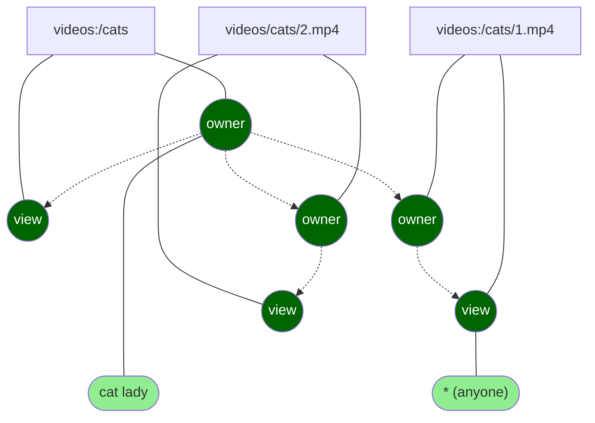
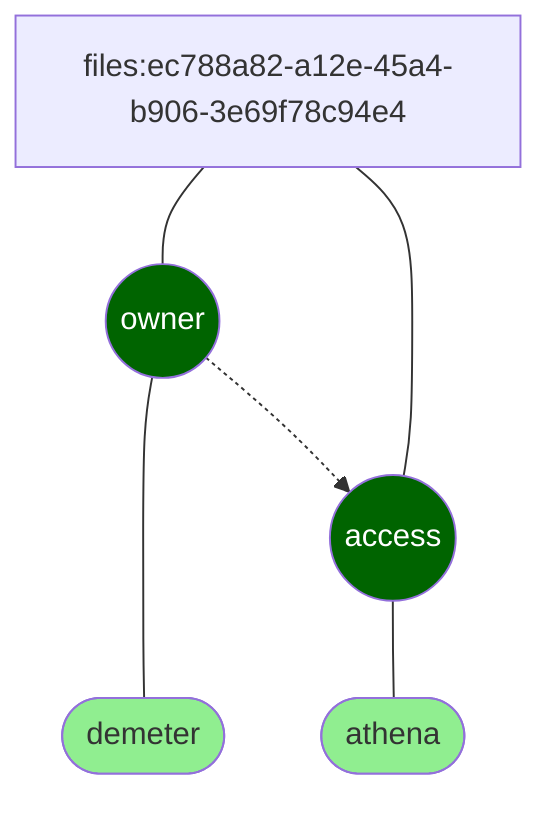

Video cats quickstart example


```mermaid
flowchart TD
  obj[videos:/cats] --- r1((owner))
  obj --- r2((view))

  r1 -.-> r2
  r1 ----- sub1(["cat lady"])
  r1 -.-> r4
  obj1 ---- r4((owner))
  r3 --- all(["* (anyone)"])
  r4 -.-> r3
  obj1[videos:/cats/1.mp4] --- r3((view))
  obj2 --- r6((view))
  r1 -.-> r5
  obj2[videos/cats/2.mp4] ---- r5((owner))
  r5 -.-> r6

  style sub1 fill:lightgreen
  style all fill:lightgreen
  style r1 fill:darkgreen,color:white
  style r2 fill:darkgreen,color:white
  style r3 fill:darkgreen,color:white
  style r4 fill:darkgreen,color:white
  style r5 fill:darkgreen,color:white
  style r6 fill:darkgreen,color:white
```


olymp library example

following code  will auto render next graph

````

```mermaid
flowchart TD
  obj1[files:ec788a82-a12e-45a4-b906-3e69f78c94e4] --- r1((owner))
  r1 ---- sub1(["demeter"])
  obj1 --- r2((access))
  r1 -.-> r2
  r2 --- sub2(["athena"])

  style sub1 fill:lightgreen
  style sub2 fill:lightgreen
  style r1 fill:darkgreen,color:white
  style r2 fill:darkgreen,color:white
```
````


```mermaid
flowchart TD
  obj1[files:ec788a82-a12e-45a4-b906-3e69f78c94e4] --- r1((owner))
  r1 ---- sub1(["demeter"])
  obj1 --- r2((access))
  r1 -.-> r2
  r2 --- sub2(["athena"])

  style sub1 fill:lightgreen
  style sub2 fill:lightgreen
  style r1 fill:darkgreen,color:white
  style r2 fill:darkgreen,color:white
```


